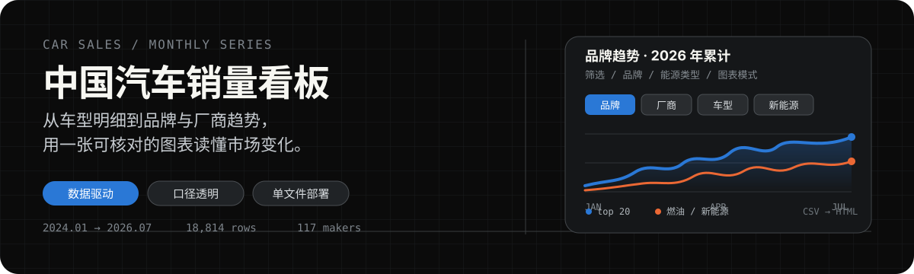

# 中国汽车销量跟踪看板

> 在线看板：**https://vannissiuu.github.io/car-sales-tracker/**

每月自动抓取中国乘用车销量数据，生成可交互的销量看板并自动发布。
正常月份**无需任何人工操作**。

---

## 一、这个工具是什么

一个自运行的汽车销量跟踪系统：

- **数据**：2024-01 至今，逐月，车型级别
- **维度**：年月 / 厂商 / 品牌 / 车体类型 / 车型 / 能源类型 / 销量
- **图表**：年份单选，横轴 1–12 月，纵轴年初至今累计销量（YTD），每个对象一条折线
- **粒度**：厂商 · 品牌 · 车体类型→车型，三种可切换
- **自动化**：每月定时抓取 → 质量校验 → 重建图表 → 发布 → 飞书通知

---

## 典型使用场景

1. **看头部格局**：选择年份，再从粒度中选择「厂商 / 品牌 / 车型」，默认展示当年累计销量 Top 20。
2. **拆解厂商或品牌的销量结构**：查看一个厂商或品牌的销量是否集中在少数几款车型上。
3. **看单个对象的趋势和同比**：判断是全年性下滑，还是只在某几个月出现波动，并观察去年同期基数。
4. **对比两个对象**：清空右侧已勾选对象，再搜索并勾选想比较的两个对象；当前构建可用「重置为 Top 20」恢复默认选择。
5. **按能源赛道分析**：将能源类型切换为「燃油 / 新能源」，观察某个品牌的新能源占比变化。
6. **查看细分市场**：将粒度设为「车体类型 → 车型」，查看对应细分市场的头部车型。
7. **查某个对象的最新动态**：目标是实时检索并返回价格调整、新车改款、产能、渠道、舆情、财务等近期信息；当前版本的新闻动态仍是缓存占位，暂无数据时显示「暂无动态」。
8. **导出数据做自己的分析**：点击「切换为表格视图」，再点击「下载 CSV」。

---

## 二、销量口径（重要）

**本数据为「零售」口径，不是批发。**

数据源（车主之家）未标注口径，此结论由外部权威数据反推得出：

| 月份 | 本数据 | 乘联会零售 | 差异 | 乘联会批发 | 差异 |
|---|---|---|---|---|---|
| 2024-01 | 203.5万 | 203.5万 | **-0.02%** | 208.9万 | -2.6% |
| 2024-12 | 264.9万 | 263.5万 | **+0.54%** | 307.5万 | -13.9% |
| 2025-12 | 225.4万 | 226.1万 | **-0.32%** | 278.9万 | -19.2% |
| 2026-06 | 161.1万 | 160.2万 | **+0.55%** | 235.8万 | -31.7% |

6 个抽查月份与乘联会零售口径差异稳定在 ±0.8% 以内且无方向性偏移；
与批发口径差异达 -2.6%～-31.7% 且随时间扩大。上险量口径已排除
（上险量通常比零售低 3–8%，而本数据比零售略高约 0.4%，方向相反）。

**跨数据源比较时请先对齐口径**，不要直接拿本看板数字与批发/产销类新闻标题比较。
数据源另声明其销量不含进口车型。

完整判定过程见 `docs-project/口径判定报告.md`。

---

## 三、三层统计口径

```
车型（最小统计单位，数据源原始字段）
  └─ 厂商（数据源原始字段，如「上汽大众」「一汽-大众」）
       └─ 品牌（本项目通过映射字典归并，如「大众」）
```

- **车型**是最小统计单位，不可再拆
- **厂商**来自数据源原始字段，未经加工
- **品牌**由 `data/mapping.json` 归并得出，解析优先级：
  `model_to_brand`（车型级覆盖）→ `manufacturer_to_brand`（厂商级）→ 兜底用厂商原值

少数厂商内含多个品牌（长城汽车含哈弗/坦克/魏牌、蔚来含蔚来/乐道/萤火虫、
上汽集团含荣威/MG/飞凡、奇瑞捷豹路虎含捷豹/路虎），这些是**按车型逐个拆分**的。

看板内可直接查看任一厂商/品牌的完整构成（点击后右侧抽屉的「统计范围」一节，不截断）。

---

## 四、仓库结构

```
.github/workflows/
├── probe.yml        数据同步（定时 + 手动）—— 抓取、校验、对账、通知
├── build.yml        图表构建（由 probe.yml 完成后链式触发）
├── archive.yml      一次性归档测试、工具和项目文档
└── probe_news.yml   新闻源探针（独立运行，不在月度主链路）

src/                 从 workflow 中落地的源码（供阅读和 diff，运行时以内嵌副本为准）
├── sync_script.py   抓取 + 校验 + 对账 + 品牌映射
├── build.py         看板 HTML 构建
└── notify_feishu.py 飞书卡片推送

tests/               回归测试（本地运行，非 CI 强制）
tools/               workflow 检查/生成辅助（部分旧生成器依赖外部临时输入，见 docs/source-of-truth.md）
docs/index.html      构建产物，GitHub Pages 发布目录
docs-project/        项目文档（实施计划、口径判定、品牌映射审阅、配置指南）

data/
├── sales.csv        主数据表（唯一数据源）
├── mapping.json     厂商/车型 → 品牌 映射字典（可直接在 GitHub 网页上编辑）
├── manufacturers.txt 厂商全名单
└── sync_report.md   最近一次同步报告（含对账结果）

probe_output/        P0 数据源探针原始结果（懂车帝/乘联会/中汽协）
probe_v3_output/     P0 车主之家探针原始结果
probe_news_output/   P3 新闻源探针原始结果
```

---

## 五、每月自动流程

```
每月 25 日 04:00 UTC（北京时间 12:00）
        │
        ▼
  只选上一个完整月份，避免抓取未结束的当月
        │
        ▼
  幂等检查 ── 已有该月数据？──是──▶ 跳过；无新数据且无异常时不发通知
        │否
        │
        ▼
  抓取（单页最多 3 次：初次 + 2 次重试，间隔 5 / 15 秒）
   · 命中 403 / 429 / 验证码时停止后续请求
   · 主榜、车体类型榜和新能源榜未完整完成的月份不写入
        │
        ▼
  数据质量记录
   · 车体类型覆盖率低于 90% 时写入质量警示
   · 车体类型对账或总量对账不平时写入质量警示
   · 失败 / 放弃月份保留旧数据，不用残缺结果覆盖
        │
        ▼
  品牌映射与按月合并 → 提交 data/ 和 sync_report.md 回仓库
        │
        ▼
  build.yml 链式触发 → 重建 docs/index.html → 提交 → GitHub Pages 发布
        │
        ▼
  配置了 FEISHU_WEBHOOK 时推送飞书卡片
   · 新数据 / 失败 / 放弃 / 拦截：推送摘要或告警
   · 纯幂等空跑：跳过通知
```

固定在每月 25 日运行一次，是因为此时上一个自然月已经完整结束。定时运行默认只尝试一个缺失月份；如果数据源尚未发布，报告会记录本次空跑，之后的月份不会被补零，也不会重复抓取。

新闻源探针是单独的 `probe_news.yml` 工作流，目前不属于月度同步主链路；看板是否显示动态取决于构建时是否存在可用的新闻缓存。

---

## 六、手动操作

### 补抓历史数据

Actions → **Sync Car Sales Data (16888)** → Run workflow：

- `max_months`：`0` = 不限制跑完全部缺失月份；`1` = 只跑一个月（默认）
- `force_refresh`：`true` = 忽略已有数据重抓（用于数据源修正后回补）

### 重建看板

Actions → **Build Car Sales Dashboard** → Run workflow

### 调整品牌归属

直接在 GitHub 网页上编辑 `data/mapping.json`，下次同步自动生效。
工作流不会覆盖已存在的该文件。

### 配置飞书通知（可选）

Settings → Secrets and variables → Actions → New repository secret，
命名 `FEISHU_WEBHOOK`，值为飞书群自定义机器人的 webhook 地址。
**未配置时通知步骤会正常跳过，不影响其他功能。**

---

## 七、修改代码的正确姿势

当前生产运行的有效源码是 `.github/workflows/` 中对应的 heredoc；`src/` 是工作流运行时落地的可读快照，下一次运行会覆盖它。两者的边界和校验方式见 `docs/source-of-truth.md`。

**安全改动流程**：

1. 从 `main` 创建隔离分支，先保存 workflow 与 `src/` 的当前 hash。
2. 明确改动对象：生产行为改 workflow heredoc；仅改文档或快照时才改 `src/`。
3. 如果使用 `tools/` 生成器，必须先确认它的输入路径在当前设备可复现；旧生成器依赖 `/tmp/p1-sync`、`/tmp/p2-chart` 时，不得把临时目录当正式源。
4. 抽取 heredoc 与 `src/` 做逐字节比对，运行本地回归测试，检查 workflow diff。
5. 通过独立 review 后再提交 PR；未经确认不要手动运行会写回 `data/`、`docs/` 或 `src/` 的 Actions。

**不要**直接修改 `src/` 并期待生产行为变化，也不要在没有可复现输入和比对结果时批量重生成 workflow。

## 八、已知局限

- **口径判定是反推的**，非数据源官方声明，置信度高但非 100% 确定
- **能源类型只有二元**（燃油 / 新能源），不区分纯电、插混、增程 —— 数据源只提供这个粒度，
  本项目不做推断以保证每一条都有据可查
- **车体类型有 4.5% 的行落在「其他」**（销量占比 1.7%，主要是五菱宏光等微面），
  这些车型不在数据源的轿车/SUV/MPV/两厢/三厢/运动汽车任一榜单中
- **新闻动态未实现**，看板抽屉内显示「暂无动态」占位。
  探针结果保留在 `probe_news_output/`，可用源已验证（新浪标签页可按品牌拼音构造 URL）
- **GitHub Pages 国内访问可能不稳定**，必要时可迁至国内对象存储
- **定时任务需仓库保持活跃** —— GitHub 可能在仓库长期没有活动时停用 schedule；如果连续空跑、没有产生新提交，仍需定期检查 Actions 是否保持启用

---

## 九、数据来源

销量数据采集自车主之家（`xl.16888.com`）月度销量排行榜。
口径校验参考乘联会（CPCA）公开月度通稿。
